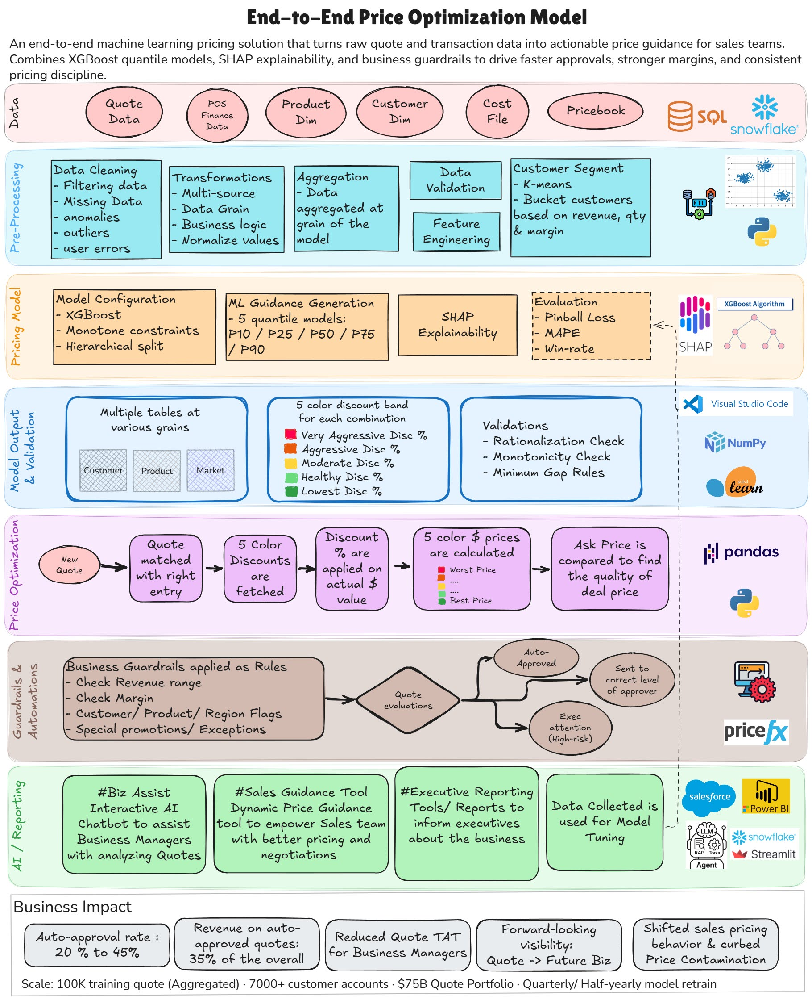

# Price Optimization ML System

Quantile-regression pricing guidance for B2B sales quoting. Five XGBoost quantile models (P10/P25/P50/P75/P90) produce a color-coded discount band for every deal configuration, with SHAP-driven explanations and monotonicity-enforced business rules.

---

## Scope of this repository

This repo is a **runnable reference implementation of the ML core** of a larger production pricing system. The full architecture (shown in the diagram below) spans data ingestion through Snowflake, a Pricefx guardrail layer, Salesforce approval routing, and a Streamlit/Power BI/LLM reporting surface. That stack is tightly coupled to proprietary enterprise systems and business logic, so this repository isolates the portable, technically interesting part — the model — and runs it end-to-end on a synthetic dataset that preserves the statistical shape of the real one.

**In this repo:** Pre-processing, quantile model training, conformal calibration, rationalization, and guidance lookup.
**Out of scope here (shown in the architecture):** Multi-source ETL, business guardrails, approval workflow, and the reporting / AI-assistant layer.

---

## Architecture (full production system)



### Layer-by-layer mapping

| Architecture Layer | In this repo | Notes |
|---|---|---|
| **Data** (Quote, POS/Finance, Product/Customer dim, Cost, Pricebook from SQL/Snowflake) | Simulated | Single synthetic `InputData.xlsx` replaces the multi-source warehouse pull |
| **Pre-Processing** (cleaning, transformation, aggregation, validation, K-means segmentation) | Full | Stages 1–3 of the notebook |
| **Pricing Model** (XGBoost config, 5 quantile models, SHAP, pinball/MAPE evaluation) | Full | Stages 4–5, plus pinball-loss reporting in Stage 8 |
| **Model Output & Validation** (guidance tables, 5-color bands, rationalization / monotonicity / min-gap) | Full | Stage 6–7 |
| **Price Optimization** (quote matching, $ conversion, ask-price comparison) | Partial | Guidance lookup implemented; the $-conversion and ask-price delta are abstracted |
| **Guardrails & Automations** (Pricefx rules, auto-approval routing, exec escalation) | Abstracted | Described, not implemented |
| **AI / Reporting** (Biz Assist chatbot, Sales Guidance tool, Power BI, Streamlit) | Abstracted | Described, not implemented |

---

## Production context (for scale reference)

The production system these techniques come from operates at:

- ~100K aggregated training quotes
- 7,000+ customer accounts
- ~$75B quote portfolio
- Quarterly / half-yearly retraining cadence
- Auto-approval rate lifted from 20% → 45%, covering ~35% of quote revenue

Numbers above describe the production deployment, not this repo. The repo runs on a 64K-row synthetic dataset.

---

## The ML core (what this repo implements)

```
Synthetic Quote Data (InputData.xlsx)
      │
      ▼
┌─────────────────────────────┐
│  Stage 1 · Data Validation  │  Discount distribution profiling, segment coverage
└─────────────────────────────┘
      │
      ▼
┌──────────────────────────────────┐
│  Stage 2 · Feature Engineering   │  Label encoding, quantity-bin parsing,
└──────────────────────────────────┘  feature set assembly
      │
      ▼
┌──────────────────────────────────┐
│  Stage 3 · Customer Segmentation │  K-Means on behavioural signals
└──────────────────────────────────┘  (avg discount, market breadth, tier rank)
      │
      ▼
┌─────────────────────────────────┐
│  Stage 4 · Model Configuration  │  XGBoost setup, monotone constraints,
└─────────────────────────────────┘  chronological train/test split
      │
      ▼
┌──────────────────────────────────────┐
│  Stage 5 · Quantile Model Training   │  5 XGBRegressor models with
└──────────────────────────────────────┘  reg:quantileerror (P10/P25/P50/P75/P90)
      │
      ▼
┌──────────────────────────────────┐
│  Stage 6 · Rationalization Check │  Conformal offsets + monotonicity enforcement
└──────────────────────────────────┘
      │
      ▼
┌──────────────────────────────────┐
│  Stage 7 · Guidance Lookup       │  Color-coded zone per deal + top-3 SHAP drivers
└──────────────────────────────────┘
      │
      ▼
┌──────────────────────────────────┐
│  Stage 8 · Validation Report     │  Pinball loss, coverage %, zone distribution
└──────────────────────────────────┘
```

---

## Output: color-coded discount bands

For any deal configuration (market × sub-market × product × customer × quantity bin × tier), the model returns five discount percentiles:

| Zone | Percentile | Meaning |
|---|---|---|
| Dark Green | ≤ P10 | Conservative — strong margin territory |
| Green | P10–P25 | Below median |
| Yellow | P25–P50 | Typical for this segment |
| Orange | P50–P75 | Aggressive |
| Red | P75–P90 | Ceiling — only ~10% of comparable deals land here |

Each prediction surfaces the **top 3 SHAP feature drivers** from the P50 model, so every guidance row is auditable.

---

## Technical decisions worth calling out

### Quantile regression via XGBoost

Five independent `XGBRegressor` models, one per target quantile, trained with the native `reg:quantileerror` objective:

```python
XGBRegressor(
    objective='reg:quantileerror',
    quantile_alpha=q,
    monotone_constraints=MONOTONE_CONSTRAINTS,
    reg_lambda=reg_lam,
    min_child_weight=mcw,
    n_estimators=500, max_depth=6, learning_rate=0.05,
)
```

Per-quantile hyperparameter overrides (`QUANTILE_OVERRIDES`) tune `reg_lambda` and `min_child_weight` for the tails — lower regularization on P10/P90 to let the extremes fit, higher on the middle quantiles for stability.

**Pinball loss** is used both as training objective (implicit in `reg:quantileerror`) and as the headline evaluation metric:

```
L_q(y, ŷ) = max( q·(y − ŷ),  (q − 1)·(y − ŷ) )
```

### Conformalized quantile regression (CQR)

Raw XGBoost quantiles are miscalibrated on the tails in practice. Stage 6 splits a calibration fold from the tail of training data, computes per-quantile residual offsets at the nominal level, and adds them back to test predictions:

```python
for q, label in zip(quantiles, ['P10','P25','P50','P75','P90']):
    preds_calib = models[label].predict(X_calib)
    scores = y_calib.values - preds_calib
    cqr_offsets[label] = np.percentile(scores, q * 100)

# At inference:
calibrated = model.predict(X_test) + cqr_offsets[label]
```

This gives approximately correct marginal coverage (~80% of actuals inside P10–P90) on the held-out period.

### Monotone constraints

XGBoost's native `monotone_constraints` bakes two business rules into the model itself rather than enforcing them post-hoc:

- **Higher quantity bin → equal or better discount** (volume incentive)
- **Higher customer tier rank → equal or better discount**

Constraints are built dynamically to stay aligned with the active feature set:

```python
constraint_map = {f: 0 for f in FEATURE_COLS_FINAL}
for up_feature in [COLS['tier_rank'], 'QTY_BIN_NUM']:
    if up_feature in constraint_map:
        constraint_map[up_feature] = 1
MONOTONE_CONSTRAINTS = tuple(constraint_map[f] for f in FEATURE_COLS_FINAL)
```

### Rationalization (quantile crossing)

Even with CQR and monotone constraints, per-row quantile crossing still happens on a fraction of predictions. Stage 6 measures the crossing rate before and after applying an enforcement pass (cumulative max from P10 → P90) and a minimum-gap rule, so the bands that reach downstream are always ordered and non-degenerate.

### Chronological train/test split

Data is sorted by `ApprovalDate` and split 80/20 — training on older quotes, validating on the most recent window. Random splits would leak future pricing regimes back into training and inflate metrics.

### K-Means behavioural segmentation

Customers are clustered on three aggregated signals — average discount, market breadth, average tier rank — and the resulting `BEHAVIORAL_CLUSTER` label is fed back into the quantile models as a feature. This captures customer-level discounting patterns that individual transaction rows can't express on their own.

### SHAP explainability

`shap.TreeExplainer` runs on the P50 model. Every guidance row ships with its top 3 feature contributions:

```
Customer Tier:  +8%
Product Family: +5%
Market Segment: −3%
```

Explainability here is a product requirement, not a nice-to-have — sales reps won't adopt guidance they can't defend in a customer conversation.

---

## Validation

| Metric | Purpose | Target |
|---|---|---|
| Pinball loss (per quantile) | Calibration of each band | Lower is better; reported per-quantile |
| Coverage | % of actuals inside P10–P90 | ~80% |
| Crossing rate (post-rationalization) | Ordered bands invariant | 0% |
| Zone distribution | Business-facing health signal | ~65% green/yellow, ~6% red |
| Rolling 90-day coverage | Drift detection | Stable over time |

Evaluation in the production system additionally tracks MAPE and win-rate impact; those are out of scope for the reference implementation.

---

## Dataset

> **Synthetic only.** No real customer, pricing, or product data is included. Statistical properties mirror the real quoting dataset.

| Property | Value |
|---|---|
| Rows | ~65,000 |
| Columns | 12 |
| Unique customers | ~7,000 |
| Unique product families | 88 |
| Primary markets | 10 |
| Sub-markets | 74 |
| Target (`Discount`) | Range 0.00–0.99, mean ~0.39 |

---

## Project structure

```
PriceModel/
├── Price_Optimization_Pipeline.ipynb   # ML core, runs end-to-end
├── InputData.xlsx                      # Synthetic input dataset
├── PriceModel_architecture.jpg         # Full-system architecture (this repo = middle layers)
└── readme.md
```

---

## Getting started

```bash
pip install pandas numpy matplotlib seaborn scikit-learn xgboost shap openpyxl
```

Open `Price_Optimization_Pipeline.ipynb` and run all cells top-to-bottom. The `DATA_FILE` constant at the top of the notebook points to `InputData.xlsx`.

---

## Tech stack

### Used in this repo
| Component | Library |
|---|---|
| Data processing | `pandas`, `numpy` |
| Quantile models | `xgboost` |
| Clustering | `scikit-learn` (KMeans, StandardScaler) |
| Explainability | `shap` |
| Visualization | `matplotlib`, `seaborn` |
| Notebook | Jupyter |

### Used in the full production system (not in this repo)
| Layer | Technology |
|---|---|
| Data warehouse | Snowflake, SQL |
| Guardrails / pricing rules | Pricefx |
| CRM / approval routing | Salesforce |
| BI / reporting | Power BI |
| Sales guidance UI | Streamlit |
| AI assistant | LLM + RAG agent stack |

---

## Model refresh and drift

The production system retrains quarterly, with drift-triggered early refresh. Drift signals:

- SHAP feature-importance shift across periods
- Rolling pinball loss or coverage moving outside target bands
- Material changes in product mix, market mix, or customer tier distribution

The reference implementation reports the first two; hooking them into a schedule or drift alerting service is left as an integration concern.

---

## Roadmap (things I'd add next to bring this repo closer to the full system)

- A mock Pricefx-style guardrail rule engine that routes a scored quote to auto-approval / manager / exec based on margin and revenue thresholds.
- A Streamlit demo of the Sales Guidance tool that takes a quote config and returns the five-color band + SHAP drivers.
- A drift-detection loop that compares rolling SHAP importances and pinball loss against a baseline window.
- A lightweight retrieval-augmented chat surface over historical quotes (the "Biz Assist" layer in the diagram).
